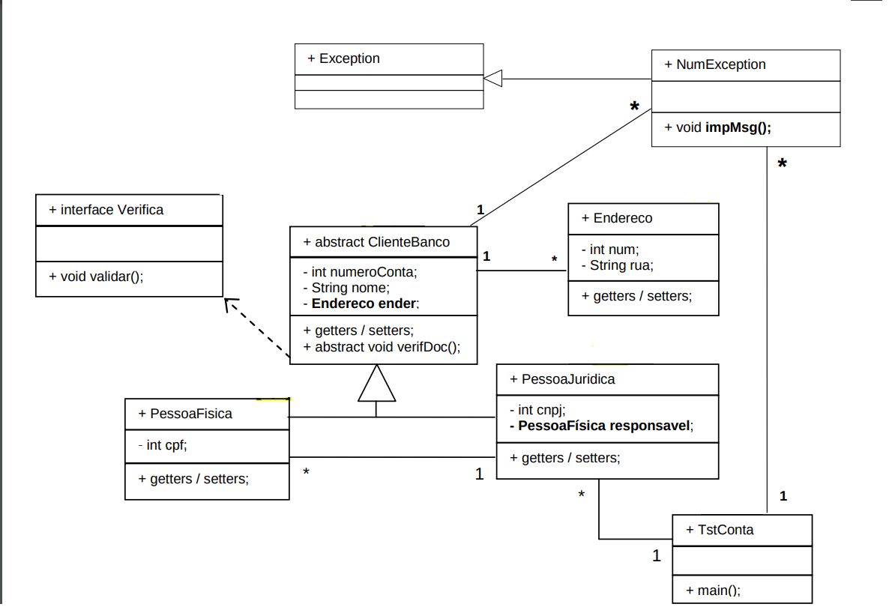

# Projeto Java I - Introdução

Projeto Java simples sem interface gráfica, gerenciado pelo Maven confeccionado como prova principal da matéria JAVA I.

---

## Sobre

Este projeto exemplifica uma aplicação Java sem interface gráfica, organizada em pacote. Utiliza Maven para gerenciamento de dependências, compilação e empacotamento.

---

## Pré-requisitos

- Java JDK 21 (ou superior)
- Maven 3.x
- Ambiente gráfico para execução da interface Swing/AWT

---

## Diagrama do Projeto



### Executar o programa

```bash
cd ./prova-chamada-um
docker build -t prova-chamada-um .
docker run -it --rm prova-chamada-um
```
